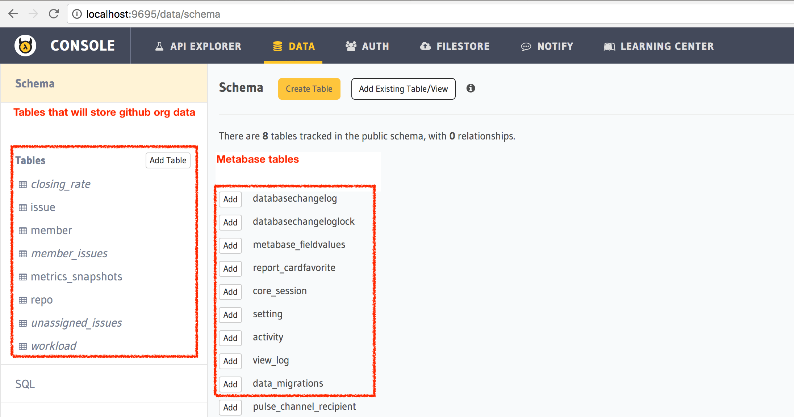
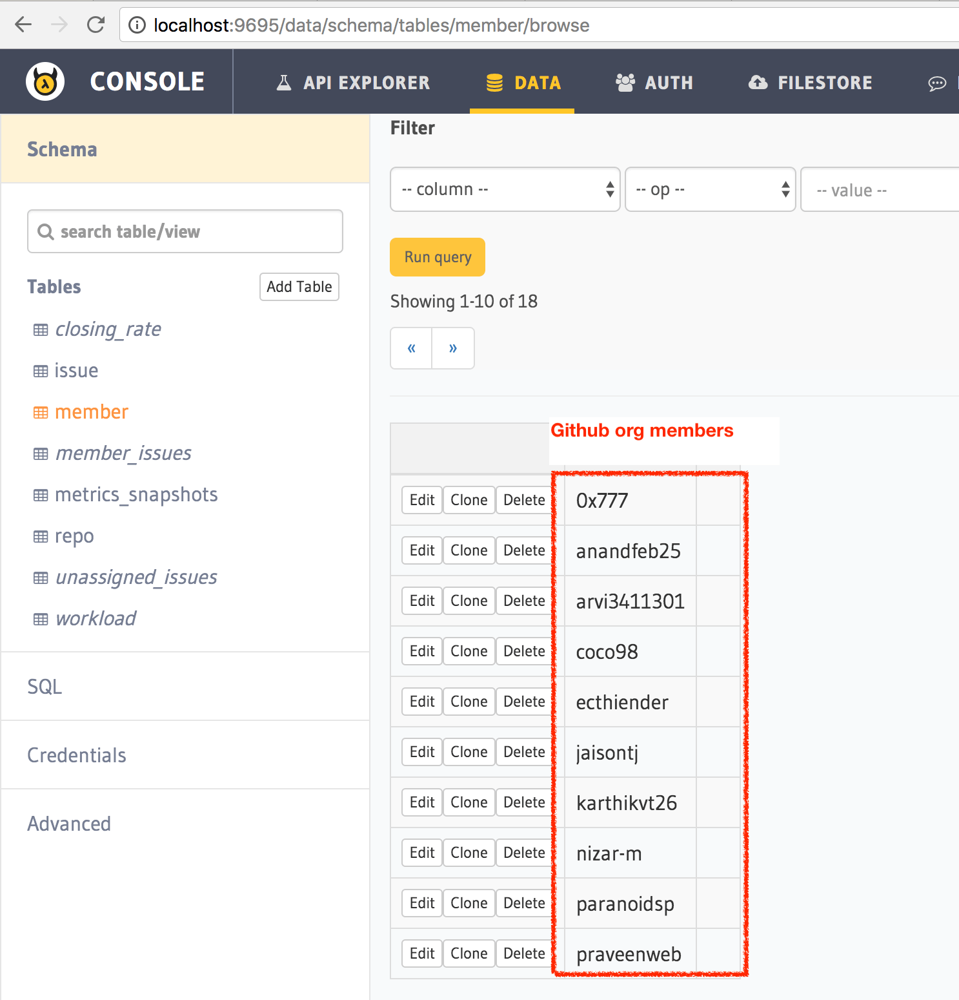
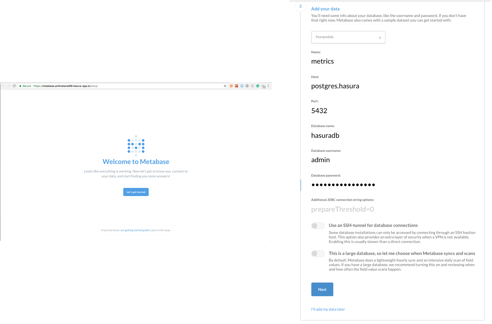

# Setup guide

This application consists of metabase, postgres, a webhook microservice, and a cron microservice.
Going through this guide and setting this up on Hasura should take you about 15-10mins.

Pre-requisites:
- A [Hasura](https://hasura.io) account: register/login [here](https://dashboard.hasura.io/register).
- Follow the [instructions](https://dashboard.hasura.io/onboarding) to install and login with the hasura CLI. 
- Enable [billing](https://dashboard.hasura.io/account/billing) on Hasura (the free tier on Hasura will not be able to run metabase).

### Step 1: Fork & clone this repo

```
$ git clone git@github.com:hasura/issues.git
```

### Step 2: Create a cluster

This command will create a Hasura cluster (2xCPU, 4GB RAM) in the San Francisco region.
Hit `y` when you're asked for confirmation:

```
$ hasura cluster create -c hasura
```

This might take 10-15 mins and will create a cluster named something like `juniper41`. 
This is what a successful output will look like:

```
• A new pro-tier Hasura cluster will be created [provider: digital-ocean, region: sfo2]
  Nodes:
  - s-2vcpu-4gb
Continue? (y/n) y
• Started provisioning cluster [juniper41]. This can take around 10-15 mins. Go ahead, grab a cup of coffee!

Completed 1/4: [juniper41] Creating a Kubernetes cluster 
Completed 2/4: [juniper41] Initializing Hasura cluster 
Completed 3/4: [juniper41] Syncing Hasura cluster 
Completed 4/4: [juniper41] Generating SSL certificates 
✓ Hasura cluster created name=juniper41
✓ SSH key (/Users/tanmaigopal/.ssh/id_rsa.pub) added to the cluster                 
✓ Git remote added to this repo name=hasura url=ssh://hasura@juniper41.hasura-app.io:22/~/git/juniper41
✓ You can now 'git push' to clusters [hasura]
✓ Cluster added to project cluster-alias=hasura cluster-name=juniper41
```

### Step 3a: Setup the github token secret

**Create a github token**

Grab your github token from https://github.com/settings/tokens.
Create a token that has read access to your orgs/repos.
Let's say the token is `123whatamagicalsecret789`.

**Set up a secret**

Setup the [secret](https://docs.hasura.io/0.15/manual/project/secrets/index.html) on your cluster:

```
$ hasura secrets update github.token 123whatamagicalsecret789
```

### Step 3b: Setup the github org environment variable

The github org environment variable is in a kubernetes manifest file.

Head to `microservices/app/k8s.yaml` and around Line#30 edit the environment variable called `GITHUB_ORG`:
```yaml
- name: GITHUB_ORG                                                                                       
  value: "my-github-org"
```  

### Step 4: Deploy

You're all setup. Let's deploy all the microservices and the postgres tables/views to the cluster:

```
$ git push hasura master
```

This might take a few minutes for all the python docker images to build.

Once this is done, to check if everything worked successfully, you can check if the right tables and views got created.

```
$ hasura api-console
• Trying to open console in browser. If it doesn't work, open the below URL manually:
• Console URL: http://localhost:9695 
```

This will open up a browser that is running an admin UI.
Head to [localhost:9695/data](http://localhost:9695/data)
and check if a bunch of tables have gotten created.



### Step 5: Initialise data from your github org

The `app` microservice running on the cluster has a bunch of APIs that help with data initialisation.

```bash
# Open the app microservice URL:
$ hasura microservice open app
✓ https://app.juniper41.hasura-app.io/ opened in browser          
```

This will open up the browser at a URL like: `app.clusterName.hasura-app.io`.
Click on the API calls mentioned on the page to start initialising your data.

Once you do this and head back to the api-console you'll see that the tables now have data.

For example:
[http://localhost:9695/data/schema/tables/member/browse](http://localhost:9695/data/schema/tables/member/browse)



### Step 6: Initialise metabase

Open up the `metabase` microservice:
```
$ hasura microservice open metabase
✓ https://metabase.juniper41.hasura-app.io/ opened in browser          
```

Metabase takes a while to startup, so if you see a 502/504 for a minute or two, don't panic.
Once you see the metabase setup screen, these are the important values you need to have to link it to postgres:

- host: `postgres.hasura`
- port: `5432`
- username: `admin`
- password: Get the password by running `hasura secrets ls` and you'll see an entry called `postgres.password`.
- database: `hasuradb`



### Step 7: Create metabase questions

That's it. Once you're logged in, start creating questions and browsing data metabase style.

### Step 8: Install the webhook on your github account so that you can keep up to date with issues

**Head to your webhooks section on github:**

[https://github.com/organizations/my-org/settings/hooks](https://github.com/organizations/my-org/settings/hooks)

**Add webhook:**
Set this URL as a webhook that can listen to changes on repos and issues.
`https://app.clusterName.hasura-app.io/webhook`

**Note:** Replace `my-org` and `clusterName` with the right values.

**Test it out:**

Create an issue and head to the issues table and see that it got added.
The issues table in your API console would be at: [http://localhost:9695/data/schema/tables/issue/browse](http://localhost:9695/data/schema/tables/issue/browse)
